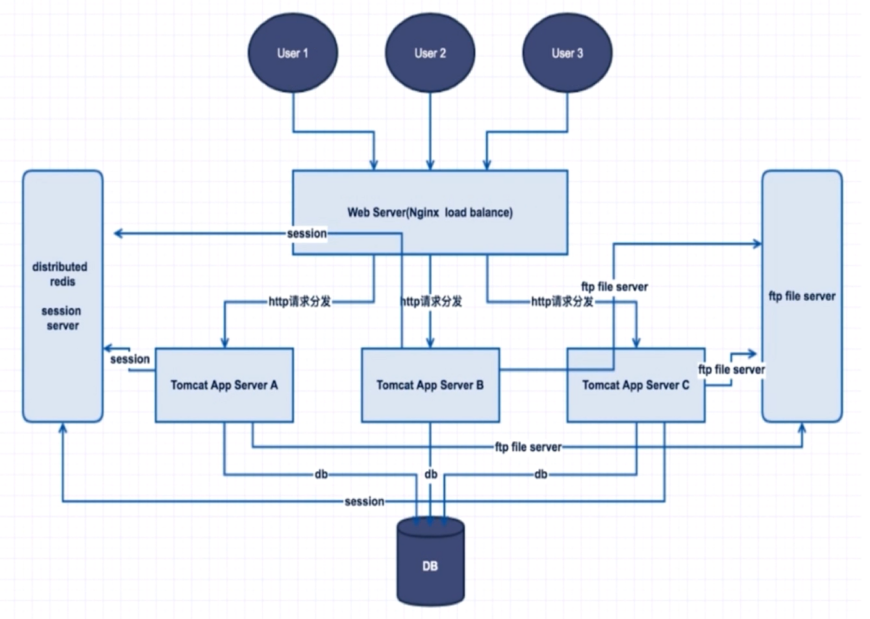

# SimpleMall 购物商城后台 2.0

## [1.0文档](https://github.com/A175A174/SimpleMall/blob/v1.0/README.md)

## v2.0变化

1.Maven环境隔离  
2.Redis实现Session共享  
3.用SpringMVC优化权限管理  
4.SpringSchedule任务调度  
5.添加Redisson分布式锁

## 接口文档

[查看接口文档](https://github.com/A175A174/SimpleMall/wiki)

## 调整服务器架构

