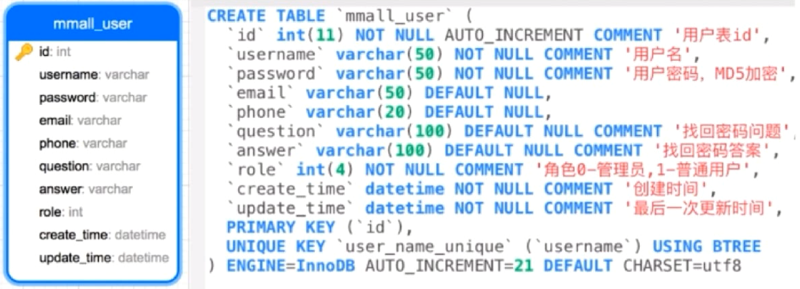
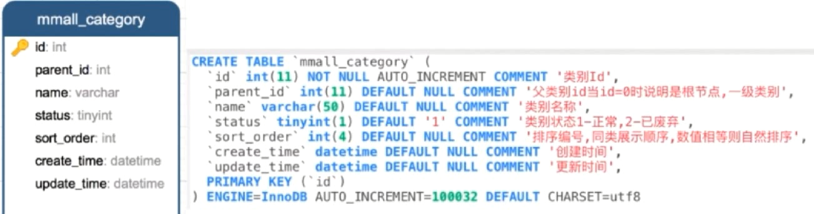
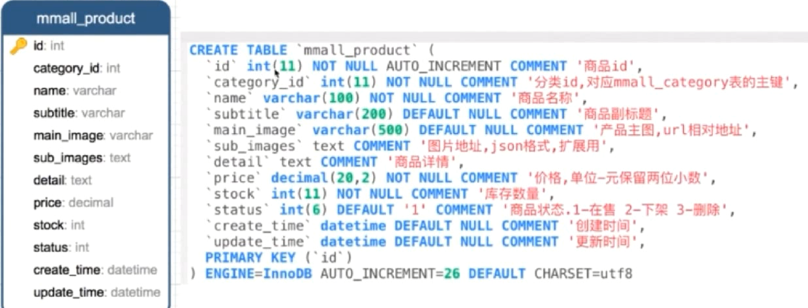
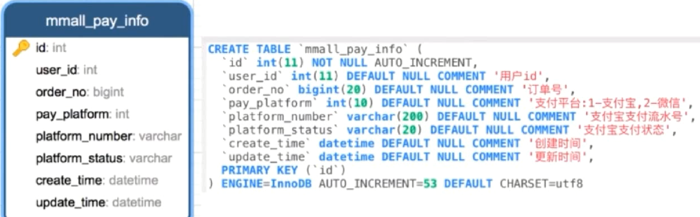
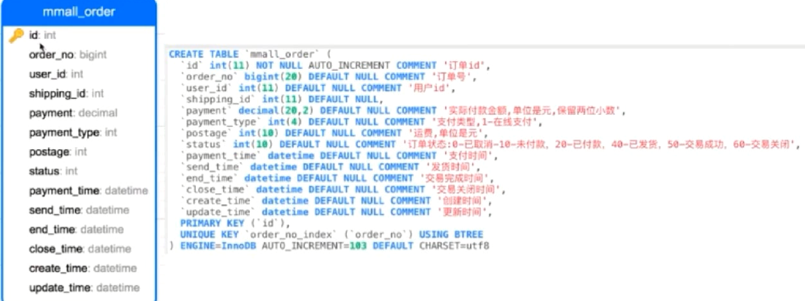
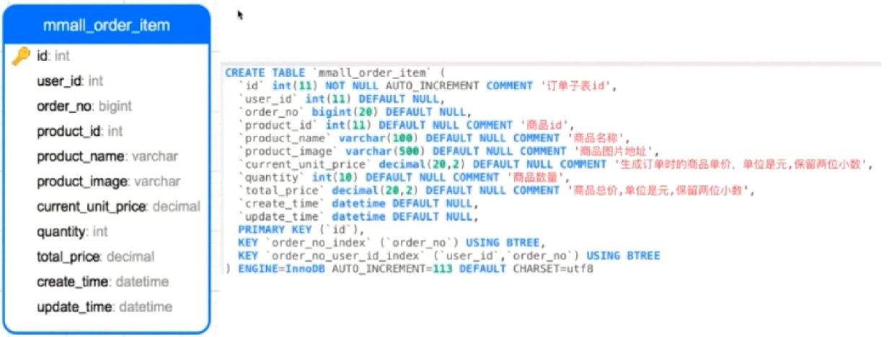
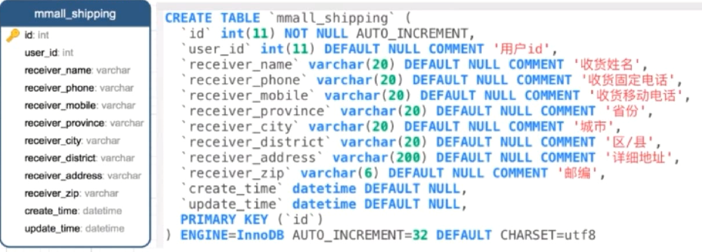
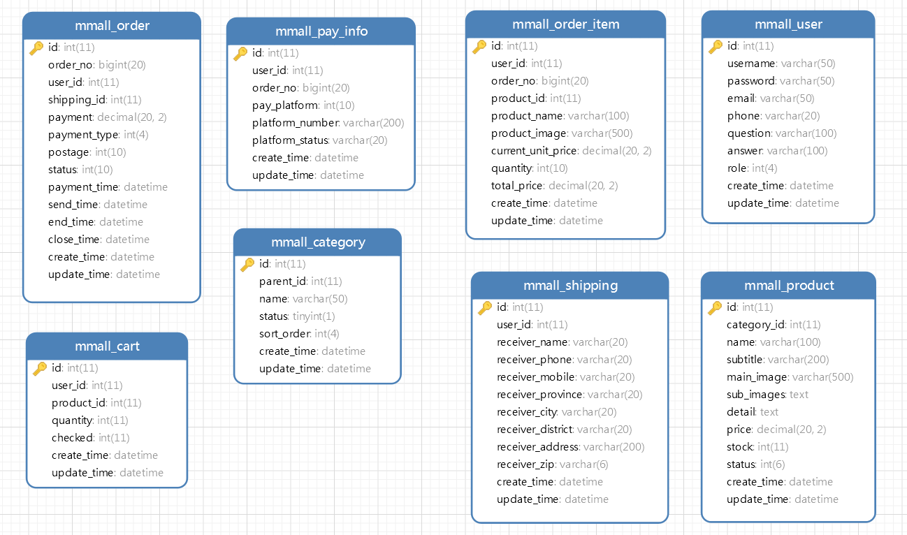
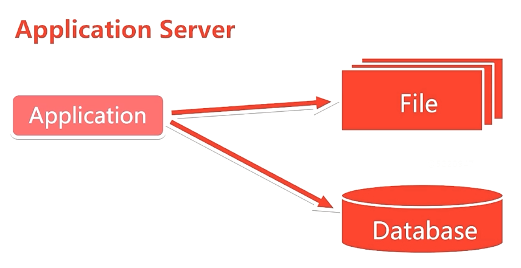
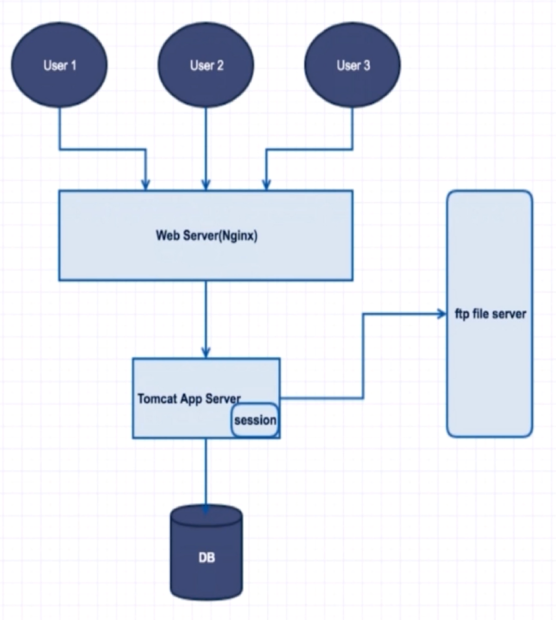

# SimpleMall 购物商城后台

# 功能模块

## 用户模块

## 分类模块

## 商品模块

## 购物模块

## 收货地址模块

## 支付模块

## 订单模块

# 接口文档

[查看接口文档](https://github.com/A175A174/SimpleMall/wiki)

# 数据库设计

## 用户表

## 类别表

## 产品表

## 购物车表

## 支付信息表

## 订单表

## 订单详情表

## 收货地址表

## 表关系

# 服务器架构

所有服务都在一台机器上

